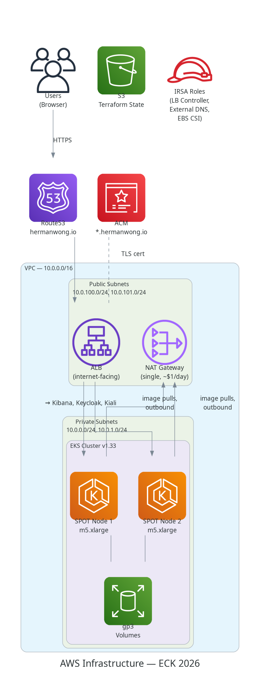
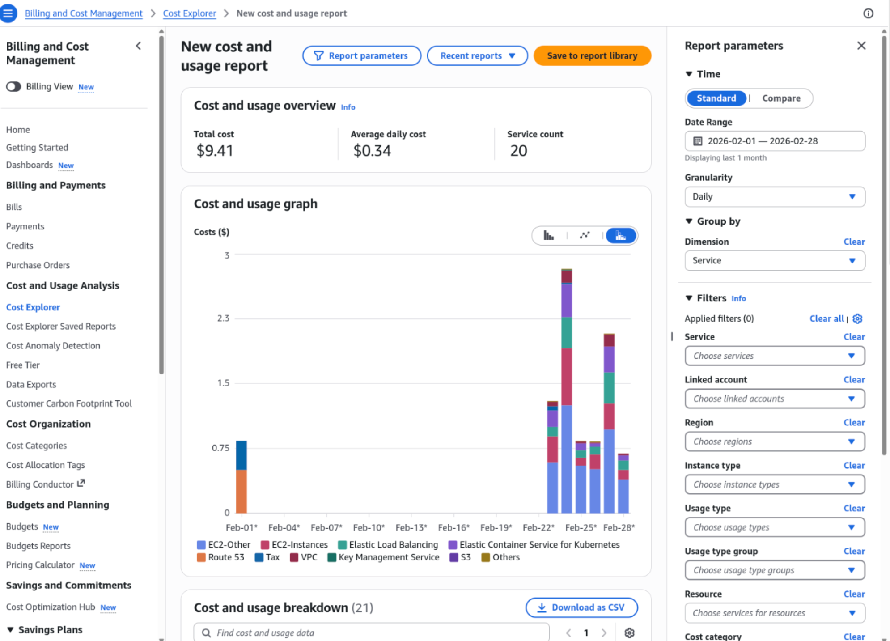
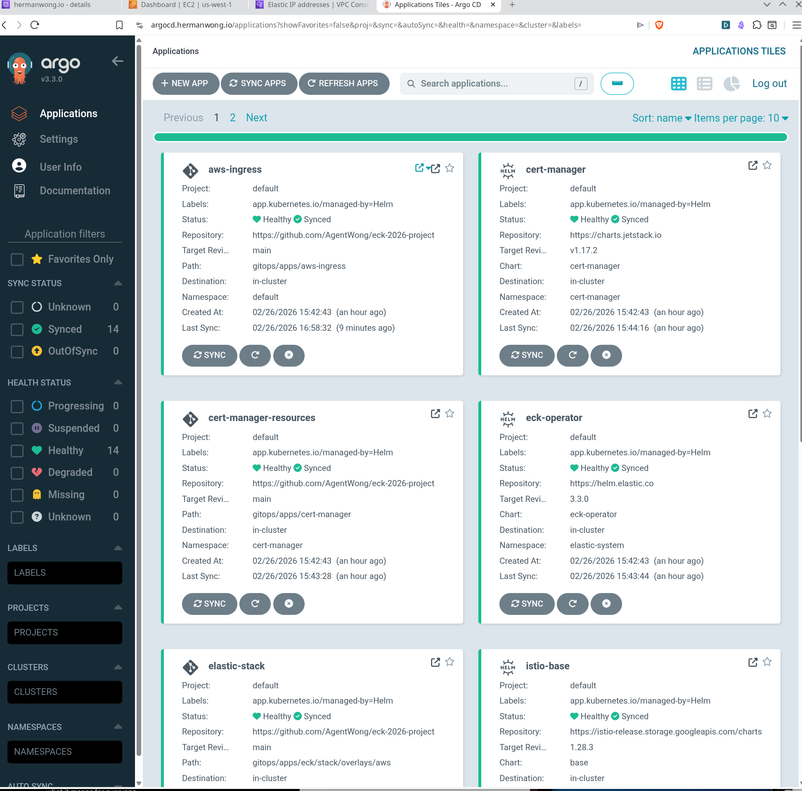
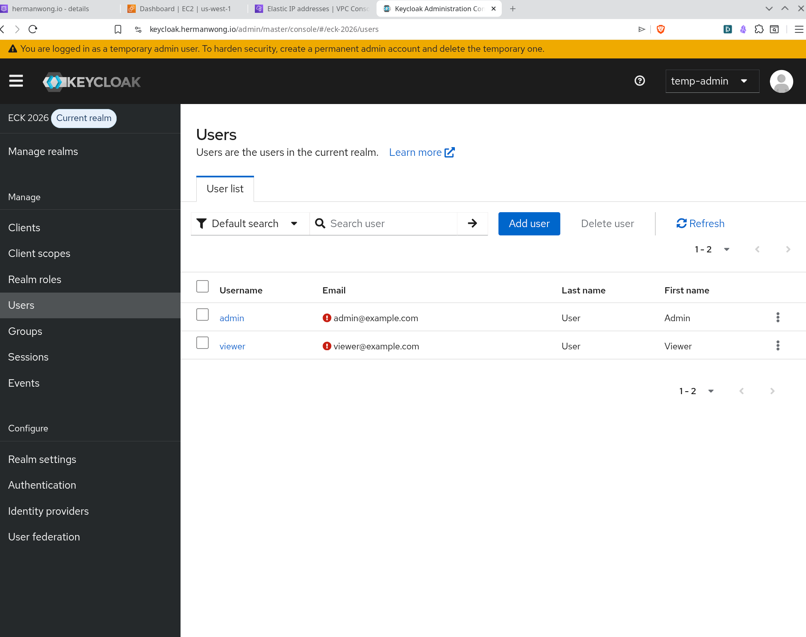
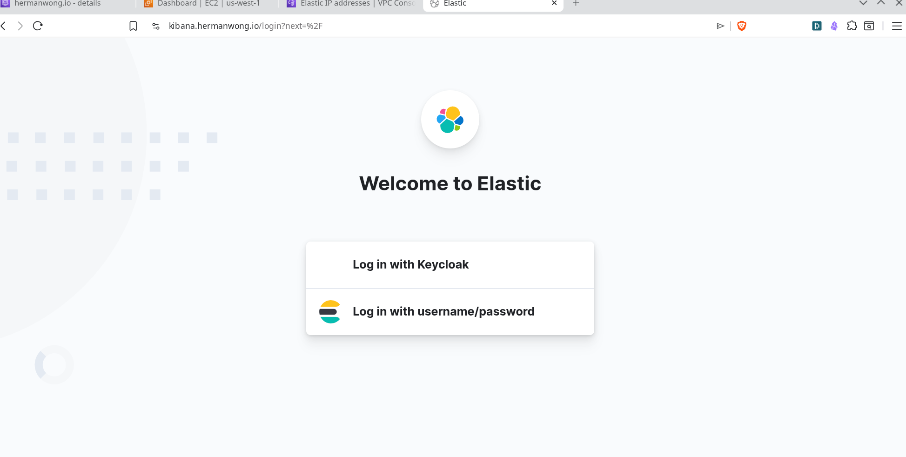
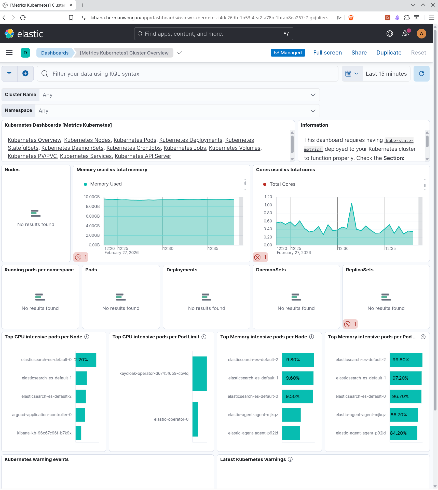
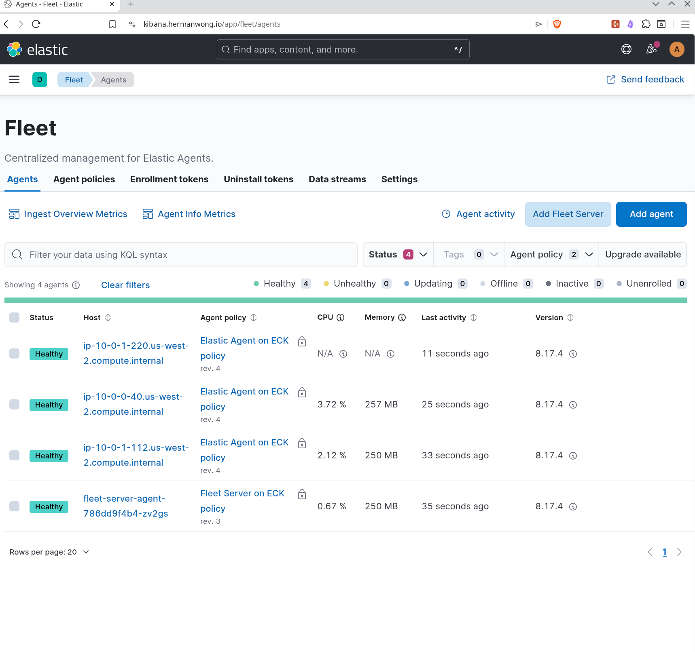
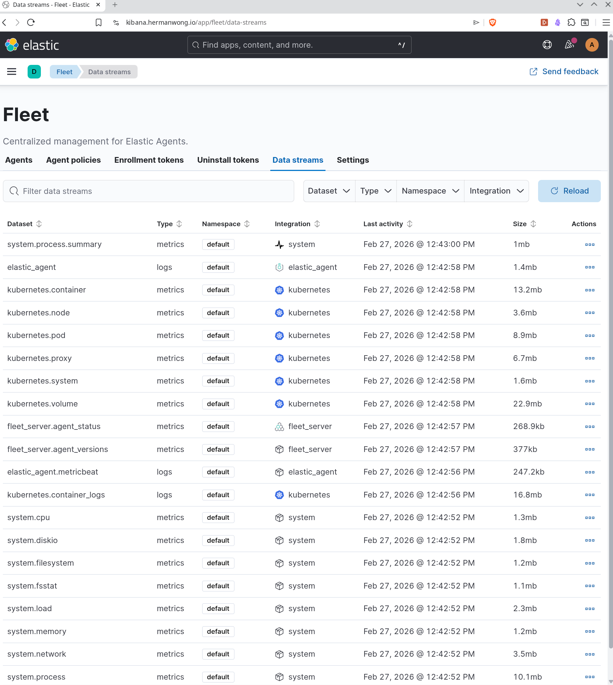
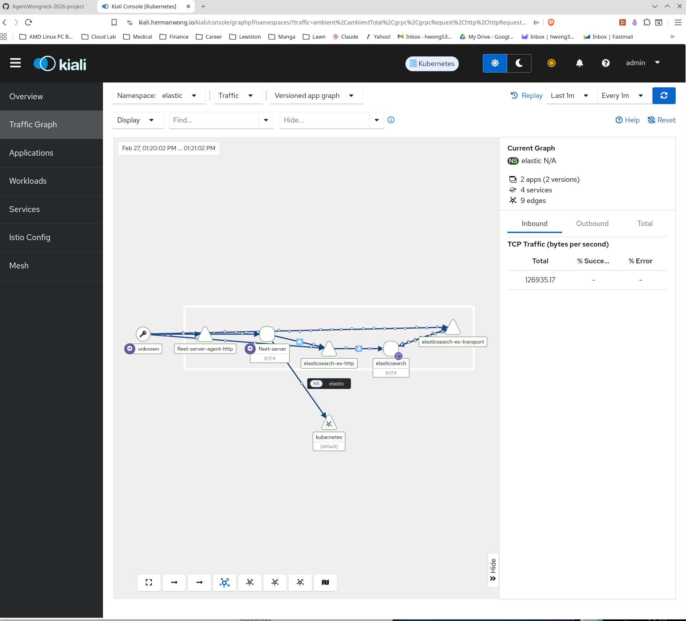
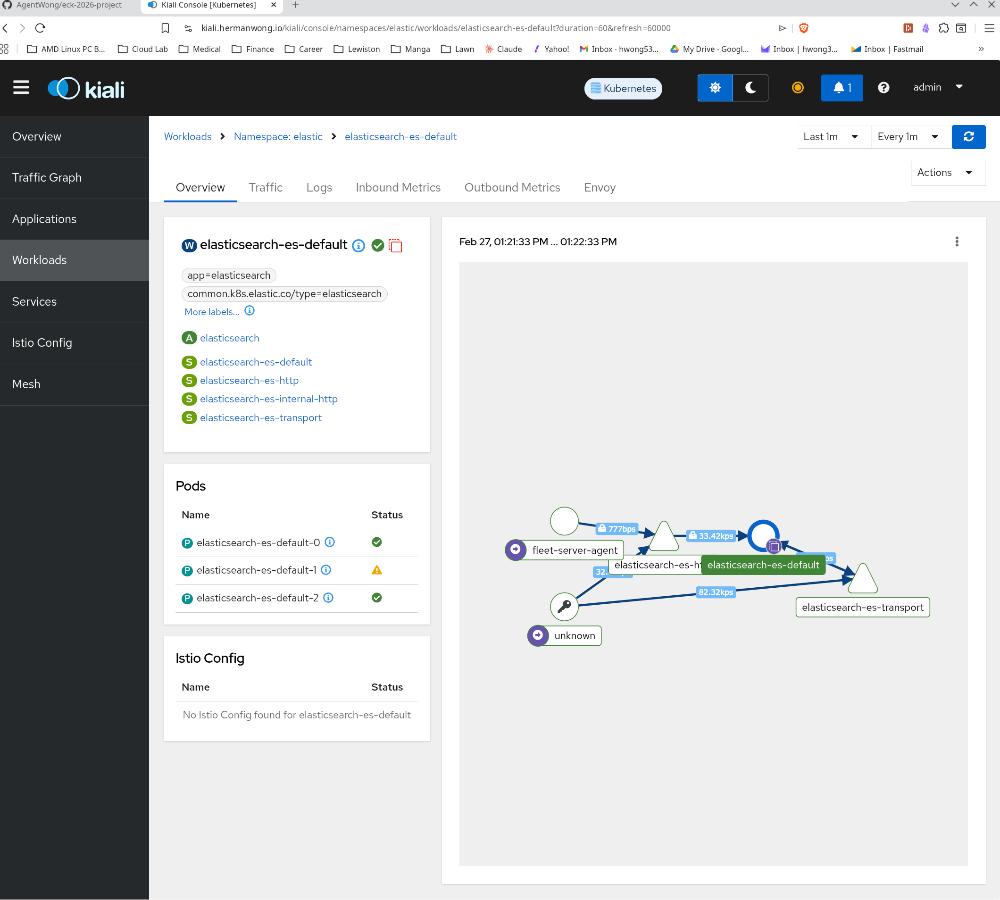

# ECK 2026 — Elastic Observability on AWS EKS

I built a full Kubernetes observability stack — Elasticsearch, Kibana, Fleet Server, Keycloak SSO, Istio service mesh — and deployed it to AWS EKS using ArgoCD GitOps. Everything lives in a single repo: Terraform for the AWS infrastructure, Helm charts for the applications, and Kustomize overlays to handle the differences between local dev and AWS.



## What This Does

A user hits `kibana.hermanwong.io` in a browser, gets redirected to Keycloak for SSO login, and lands in Kibana with role-based access (admin gets superuser, viewer gets read-only). Behind that login page, Elastic Agents running as DaemonSets on every EKS node collect container logs, kubelet metrics, and system metrics, then ship them through Fleet Server into Elasticsearch. Kibana dashboards show the cluster's health in real time.

ArgoCD keeps the whole thing in sync from git — 14 applications across 7 sync waves, automated self-healing, and prune enabled. Delete a resource manually, and ArgoCD puts it back within a few minutes. Istio sidecars on the Elastic namespace pods give L7 traffic observability through Kiali. NetworkPolicies enforce default-deny ingress on every application namespace, with selective allow rules for the specific ports each component needs.


## Why I Built It This Way

### Local-First Development

I wrote all the manifests and tested them on Rancher Desktop K3s first. The feedback loop was fast — edit a YAML file, `helm template` to catch syntax issues, `kubectl apply`, and check pod status. Sub-30-second iteration. This is also where AI-assisted development made the most sense. I used LLMs to help write and debug the Kubernetes manifests, OIDC configurations, and NetworkPolicies. Running everything locally meant I could experiment without worrying about AWS bills or accidentally breaking a shared environment.

K3s has some quirks compared to EKS (no IRSA, different default StorageClass, no ALB support), but the core application logic — the Elasticsearch CRs, Kibana OIDC config, Keycloak realm setup, Fleet Server enrollment — is identical. That was the whole point: get the hard parts working locally, then swap out the infrastructure bits for AWS equivalents.

### Lift-and-Shift to AWS

The move to EKS came down to four changes:

1. **Ingress**: Port-forwarding → ALB via AWS Load Balancer Controller. Each service (Kibana, Keycloak, Kiali) gets its own Ingress resource with ALB annotations.
2. **TLS**: Self-signed certs from cert-manager → ACM wildcard certificate (`*.hermanwong.io`). Free, auto-renewing, no manual rotation.
3. **Storage**: `local-path` → `gp3` EBS volumes via the CSI driver. Set as the default StorageClass so Elasticsearch PVCs just work.
4. **DNS**: `localhost` via port-forward → Route53 records created automatically by External DNS from Ingress annotations.

Same ArgoCD bootstrap chart, same application manifests, different `values-aws.yaml` file. The Kustomize overlays handle the per-environment patches (Keycloak hostname, Elasticsearch node count, resource limits).

## AWS Architecture


### VPC and Networking

- **VPC**: `10.0.0.0/16` across 2 AZs (`us-west-2a`, `us-west-2b`)
- **Public subnets** (`10.0.100.0/24`, `10.0.101.0/24`): ALB and NAT Gateway live here
- **Private subnets** (`10.0.0.0/24`, `10.0.1.0/24`): EKS worker nodes, not directly reachable from the internet
- **Single NAT Gateway**: Costs about $1/day. A production setup would use one per AZ for redundancy, but this is a dev environment and I'd rather save the money.

### EKS Cluster

- **Kubernetes v1.33**, managed node groups
- **SPOT instances** (`m5.xlarge`, `m5a.xlarge`, `m5d.xlarge`) — 2 nodes desired, up to 4 max. SPOT saves 60-80% vs on-demand. The tradeoff is potential interruptions, but for a dev/portfolio project, that's fine.
- **EBS CSI driver** with `gp3` as the default StorageClass (replaces the deprecated in-tree `gp2` driver)

### DNS and TLS

- **Route53** hosted zone for `hermanwong.io` + **External DNS** watching Ingress resources. Create an Ingress with the right annotation, and the DNS record appears automatically.
- **ACM wildcard certificate** (`*.hermanwong.io`) — terminates TLS at the ALB. No cert management headaches.

### Load Balancing

- **AWS ALB** via Load Balancer Controller (Helm chart)
- Three public endpoints: `kibana.hermanwong.io`, `keycloak.hermanwong.io`, `kiali.hermanwong.io`
- CIDR-restricted — the ALB only accepts traffic from my current IP (detected at deploy time by Terraform)

### IAM

- **IRSA** (IAM Roles for Service Accounts) for: Load Balancer Controller, External DNS, EBS CSI Driver
- No static AWS credentials anywhere on the cluster

### Cost

Infracost reports ~$648/month, but that's misleading. It prices SPOT instances at on-demand rates and assumes 24/7 uptime with max node count.

Real cost breakdown for an 8-hour session:

| Component | Rate | 8-hr Cost |
|-----------|------|-----------|
| EKS Control Plane | $0.10/hr | $0.80 |
| 2x m5.xlarge SPOT | ~$0.065/hr each | $1.04 |
| NAT Gateway | $0.045/hr | $0.36 |
| NAT data transfer | $0.045/GB | ~$0.05-$0.20 |
| EBS root volumes | $0.08/GB-month | ~$0.04 |
| **Total** | | **~$2.29/day** |

I tear down the infrastructure at the end of each session with `terragrunt run-all destroy`. No overnight charges. Real monthly cost at 8 hrs/day: **~$69/month**.

<!-- Screenshot: February Billing Cost -->


This is the costs for roughly a week of sandbox testing and proof-of-concept deployments.

## Application Stack

### GitOps with ArgoCD

Everything is deployed through ArgoCD's App of Apps pattern. One bootstrap Helm chart creates 14 child Applications, and sync waves make sure things come up in the right order — cert-manager before TLS certificates, ECK Operator before Elasticsearch, Keycloak before NetworkPolicies.


<!-- Screenshot: ArgoCD showing all applications synced and healthy -->


### Keycloak SSO

I used the Keycloak Operator with upstream `quay.io/keycloak/keycloak` images (not Bitnami — avoided the licensing headache). The database is embedded H2 (`dev-file` mode), which means no RDS dependency and fast teardown. Not what you'd use in production, but it keeps the infrastructure simple and the destroy cycle under 15 minutes.

The `eck-2026` realm has two OIDC clients (`kibana` and `argocd`) and two test users:
- `admin` / `admin` → maps to Elasticsearch `superuser` role
- `viewer` / `viewer` → maps to `kibana_admin` + `viewer` roles

The role mapping happens in Elasticsearch via a post-sync Job that calls the `_security/role_mapping` API.

<!-- Screenshot: Keycloak admin console showing users in eck-2026 realm -->


<!-- Screenshot: Kibana login page with "Log in with Keycloak" button -->


### Elasticsearch + Kibana

ECK Operator (v3.3.0) manages Elasticsearch 8.17.4 and Kibana as custom resources. On AWS, Elasticsearch runs 2-3 nodes with 4GB each on `gp3` persistent volumes.

The OIDC configuration was the trickiest part. Elasticsearch needs to validate tokens from Keycloak, but EKS doesn't support hairpin NAT — pods can't reach external ALB endpoints from inside the cluster. The fix: front-channel OIDC calls (browser redirects) use the public URL (`keycloak.hermanwong.io`), while back-channel calls (token validation, JWKS) use internal Kubernetes DNS (`keycloak-service.keycloak.svc:8443`). Keycloak's `backchannelDynamic: true` setting makes this work.

<!-- Screenshot: Kibana K8s Overview dashboard showing EKS cluster metrics -->


### Fleet Server + Elastic Agent

Fleet Server handles enrollment and policy management. Elastic Agent runs as a DaemonSet — one agent per node — collecting Kubernetes logs and metrics via the `kubernetes` and `system` integration packages.

The agent uses `hostNetwork: true` and is excluded from Istio sidecar injection. It needs direct access to the node's container runtime socket to collect logs.

<!-- Screenshot: Kibana Fleet page showing the enrolled agent -->


<!-- Screenshot: Fleet Server data streams showing proper data ingestion -->


### Observability Data Flow


Two parallel observability pipelines:

1. **Elastic pipeline**: K8s nodes → Elastic Agent (DaemonSet) → Fleet Server → Elasticsearch → Kibana dashboards
2. **Istio pipeline**: Application pods → Envoy sidecars → Prometheus (scrapes :15020/:15090) → Kiali (service mesh topology)

### Service Mesh (Istio)

Istio runs in sidecar mode on the `elastic` namespace. Elasticsearch, Kibana, and Fleet Server pods each get an Envoy proxy. Kiali reads from Prometheus to display the service mesh graph.

One thing worth noting: Kiali shows L7 traffic patterns (which pods talk to each other, HTTP status codes, request rates) but not port numbers. NetworkPolicies operate at L3/L4 with specific ports. I built the NetworkPolicies from component documentation and testing, not from Kiali.

<!-- Screenshot: Kiali traffic graph for the elastic namespace.
     Navigation: Graph (left sidebar) → Namespace: elastic → Display dropdown: enable "Traffic Animation" and "Security" → wait ~30s for live traffic to populate.
     The graph should show Elasticsearch, Kibana, and Fleet Server nodes connected by animated edges, each node labelled with a lock icon (mTLS). -->


<!-- Screenshot: Kiali workload detail for the elasticsearch workload.
     Navigation: Workloads (left sidebar) → Namespace: elastic → select "elasticsearch-es-default" → Overview tab.
     The panel shows inbound/outbound request rates (RPS), HTTP status code breakdown (2xx/4xx/5xx), and the list of connected services. -->


### Network Security


Every application namespace starts with a `default-deny-ingress` policy. Then selective allow rules open exactly the ports each component needs:

- Kibana → Elasticsearch `:9200`
- Fleet Server → Elasticsearch `:9200`
- Elastic Agent → Fleet Server `:8220`
- Elastic Agent → Elasticsearch `:9200`
- ES node ↔ ES node `:9300` (transport)
- ECK Operator → Elasticsearch `:9200`, Kibana `:5601`
- Prometheus → sidecar metrics `:15020`, `:15090`

8 policies in the `elastic` namespace alone. Cross-namespace traffic from `istio-system` (Prometheus) and `elastic-system` (ECK Operator) uses namespace selectors.

## Repository Structure

```
eck-2026-project/
├── docs/                       # Documentation, diagrams, screenshots
│   ├── diagrams/scripts/       # Python scripts (diagrams-as-code)
│   ├── diagrams/output/        # Generated PNG diagrams
│   └── screenshots/            # Application screenshots
├── gitops/
│   ├── bootstrap/              # ArgoCD App of Apps (Helm chart)
│   │   ├── values-local.yaml   # K3s overrides
│   │   └── values-aws.yaml     # EKS overrides
│   └── apps/                   # Per-component configs
│       ├── eck/                # Elasticsearch, Kibana, Fleet, Agent
│       ├── keycloak/           # Keycloak Operator + realm
│       ├── network-policies/   # Default-deny + allow rules
│       └── aws-ingress/        # ALB Ingress (AWS only)
├── terraform/
│   ├── modules/                # vpc, eks, eks-addons, argocd-bootstrap, acm, security-context
│   └── environments/dev/       # Terragrunt environment config
└── scripts/                    # setup, port-forward, teardown
```

## Stack Versions

| Component | Chart Version | App Version |
|-----------|---------------|-------------|
| ArgoCD | 9.4.1 | v3.3.0 |
| cert-manager | v1.17.2 | v1.17.2 |
| Istio | 1.28.3 | 1.28.3 |
| Kiali | 2.7.0 | v2.7.0 |
| Prometheus | 28.9.1 | v3.9.1 |
| ECK Operator | 3.3.0 | 3.3.0 |
| Elasticsearch | — | 8.17.4 |
| Kibana | — | 8.17.4 |
| Fleet Server | — | 8.17.4 |
| Elastic Agent | — | 8.17.4 |
| Keycloak | — | 26.5.3 |

## Deploying Your Own Instance

If you fork this repo and deploy it yourself, you'll need to configure a few things:

1. **Terraform secrets**: Copy `terraform/environments/dev/secrets.hcl.example` to `secrets.hcl` and fill in your AWS Account ID, Route53 Hosted Zone ID, ACM certificate ARN, and S3 state bucket name. This file is gitignored.

2. **OIDC client secrets**: The Keycloak realm import job and the Kubernetes Secrets for Kibana, Kiali, and ArgoCD all contain `REPLACE_WITH_STRONG_SECRET` placeholders. Generate unique secrets (e.g., `openssl rand -hex 32`) and set the same value in both the Keycloak client config and the corresponding Kubernetes Secret.

3. **ACM certificate ARN**: Update `gitops/bootstrap/values-aws.yaml` with your ACM wildcard certificate ARN.

4. **Allowed CIDR**: The default `allowedCidr` is `0.0.0.0/32` (deny-all). At deploy time, pass your IP via `--set awsIngress.allowedCidr=<your-ip>/32`. The Terraform `security-context` module outputs this automatically.

5. **Demo credentials**: The Keycloak realm creates two users with trivial passwords — `admin`/`admin` and `viewer`/`viewer`. These are intentional for demo/portfolio purposes. For any real deployment, change these immediately or set `"temporary": true` to force password change on first login.

## Documentation

| Guide | Description |
|-------|-------------|
| [Architecture](docs/architecture.md) | Component stack, dependency graph, design decisions, local vs AWS differences |
| [Getting Started](docs/getting-started.md) | Service access, credentials, verification commands |
| [Teardown and Rebuild](docs/teardown-and-rebuild.md) | Step-by-step destroy/recreate for both environments |
| [Implementation Plan](docs/implementation-plan.md) | Original phased design document (all phases complete) |

## Diagrams as Code

The architecture diagrams are generated from Python scripts using the [`diagrams`](https://diagrams.mingrammer.com/) library. To regenerate:

```bash
pip install -r docs/diagrams/scripts/requirements.txt
for script in docs/diagrams/scripts/*.py; do python "$script"; done
```

Requires `graphviz` system package (`sudo pacman -S graphviz` / `brew install graphviz`).
