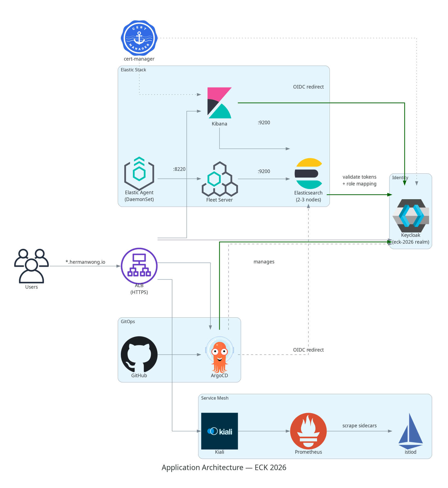
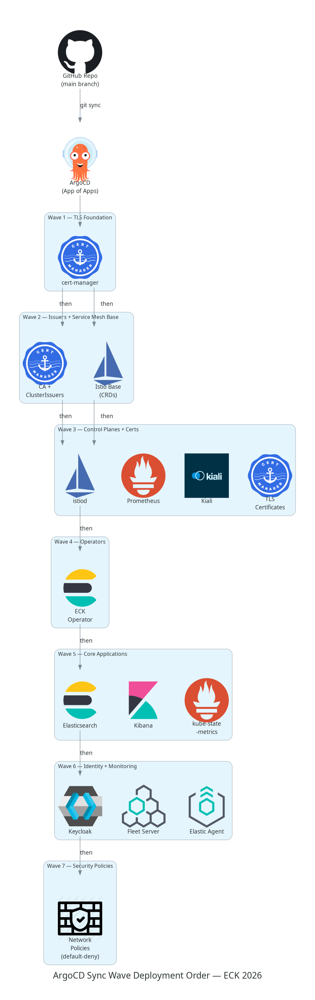
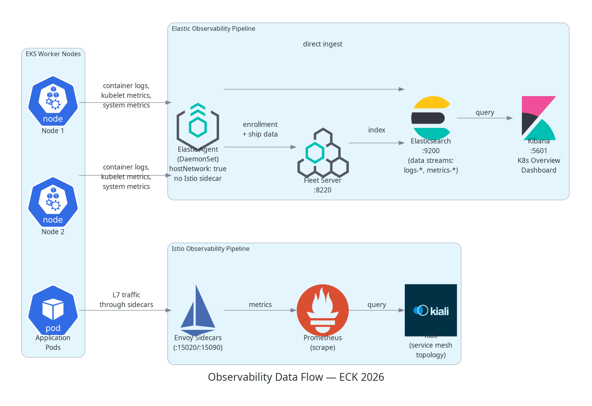
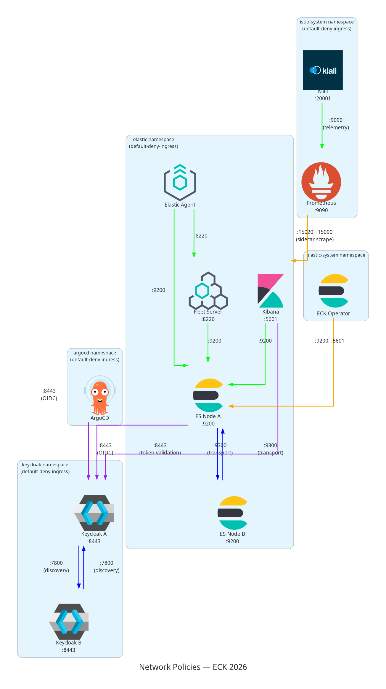

# Architecture

## Overview

ECK 2026 is an Elastic Cloud on Kubernetes project that deploys a full observability stack with GitOps, service mesh, SSO, and network segmentation. It targets two environments from a single mono-repo: local development on Rancher Desktop K3s and production on AWS EKS.

## Component Stack





## Dependency Graph

Components must be deployed in this order. Teardown is the reverse.

```
cert-manager (sync-wave: 1)
├── cert-manager-resources (sync-wave: 2) — CA + ClusterIssuers
├── Istio base (sync-wave: 2) + istiod (sync-wave: 3) — webhook certs
│       ├── Prometheus + Kiali (sync-wave: 3) — Istio telemetry
│       ├── TLS certificates (sync-wave: 3) — component certs
│       └── ECK Operator (sync-wave: 4) — sidecar injection
│               └── Elastic Stack + kube-state-metrics (sync-wave: 5)
│                       ├── Keycloak (sync-wave: 6) — OIDC provider
│                       ├── Monitoring (sync-wave: 6) — Fleet Server + Elastic Agent
│                       └── Network Policies (sync-wave: 7) — after traffic patterns known
```

## Data Flow



## Network Policies



## Repository Structure

```
eck-2026-project/
├── docs/                            # Project documentation
│   ├── diagrams/
│   │   ├── scripts/                 # Python diagram-as-code scripts
│   │   │   └── icons/               # Custom node icons (Keycloak, Kiali)
│   │   └── output/                  # Generated PNG diagrams
│   ├── screenshots/                 # Application screenshots
│   ├── getting-started.md           # Accessing services, credentials
│   ├── architecture.md              # This file
│   ├── teardown-and-rebuild.md      # Destroy/recreate procedures
│   └── implementation-plan.md       # Original design document
│
├── scripts/
│   ├── setup-local.sh               # Tool install verification
│   ├── port-forward.sh              # Quick access to local services
│   └── teardown-local.sh            # Local stack teardown
│
├── gitops/                          # Everything ArgoCD manages
│   ├── bootstrap/                   # App of Apps parent chart
│   │   ├── Chart.yaml
│   │   ├── values.yaml              # Common values
│   │   ├── values-local.yaml        # Rancher Desktop overrides
│   │   ├── values-aws.yaml          # EKS overrides
│   │   └── templates/               # One ArgoCD Application per component
│   │       ├── cert-manager.yaml            (sync-wave: 1)
│   │       ├── cert-manager-resources.yaml  (sync-wave: 2)
│   │       ├── istio-base.yaml              (sync-wave: 2)
│   │       ├── istio-istiod.yaml            (sync-wave: 3)
│   │       ├── kiali.yaml                   (sync-wave: 3)
│   │       ├── prometheus.yaml              (sync-wave: 3)
│   │       ├── tls-certificates.yaml        (sync-wave: 3)
│   │       ├── eck-operator.yaml            (sync-wave: 4)
│   │       ├── elastic-stack.yaml           (sync-wave: 5)
│   │       ├── kube-state-metrics.yaml      (sync-wave: 5)
│   │       ├── keycloak.yaml                (sync-wave: 6)
│   │       ├── monitoring.yaml              (sync-wave: 6)
│   │       ├── network-policies.yaml        (sync-wave: 7)
│   │       ├── aws-ingress.yaml             (sync-wave: 5, AWS only)
│   │       └── repo-secret.yaml             (GitHub repo auth)
│   └── apps/                        # Per-component config
│       ├── cert-manager/            # Self-signed ClusterIssuer
│       ├── eck/
│       │   ├── operator/            # ECK operator values
│       │   ├── stack/               # Elasticsearch + Kibana CRs
│       │   │   ├── base/            # Common CRs
│       │   │   └── overlays/        # local/ and aws/ Kustomize overlays
│       │   └── monitoring/          # Fleet Server + Elastic Agent
│       ├── keycloak/                # Keycloak CR + realm import
│       │   ├── base/                # Keycloak instance + realm import job
│       │   └── overlays/            # local/ and aws/ Kustomize overlays
│       ├── tls/                     # TLS certificates for all components
│       ├── network-policies/        # NetworkPolicy manifests
│       └── aws-ingress/             # ALB Ingress resources (AWS only)
│
├── terraform/                       # AWS infrastructure only
│   ├── terragrunt.hcl               # Root config (S3 backend)
│   ├── modules/
│   │   ├── vpc/                     # Wraps terraform-aws-modules/vpc/aws
│   │   ├── eks/                     # Wraps terraform-aws-modules/eks/aws
│   │   ├── argocd-bootstrap/        # Helm provider deploys ArgoCD
│   │   ├── eks-addons/              # LB Controller, External DNS, EBS CSI
│   │   ├── acm/                     # ACM certificate lookup
│   │   └── security-context/        # IAM roles, CIDR restrictions
│   └── environments/
│       └── dev/
│           ├── terragrunt.hcl
│           ├── vpc/
│           ├── eks/
│           ├── argocd-bootstrap/
│           ├── eks-addons/
│           ├── acm/
│           └── security-context/
│
└── .github/
    ├── agents/                      # Copilot agent definitions
    │   ├── local-k8s-test.agent.md
    │   └── aws-eks-test.agent.md
    └── prompts/                     # Reusable Copilot prompts
        ├── deploy-local.prompt.md
        ├── teardown-local.prompt.md
        ├── verify-local.prompt.md
        ├── deploy-aws.prompt.md
        ├── teardown-aws.prompt.md
        └── verify-aws.prompt.md
```

## Component Versions

| Component | Chart / Method | Chart Version | App Version |
|-----------|---------------|---------------|-------------|
| ArgoCD | `argo/argo-cd` | 9.4.1 | v3.3.0 |
| cert-manager | `jetstack/cert-manager` | v1.17.2 | v1.17.2 |
| Istio base | `istio/base` | 1.28.3 | 1.28.3 |
| Istiod | `istio/istiod` | 1.28.3 | 1.28.3 |
| Kiali | `kiali/kiali-server` | 2.7.0 | v2.7.0 |
| Prometheus | `prometheus-community/prometheus` | 28.9.1 | v3.9.1 |
| kube-state-metrics | `prometheus-community/kube-state-metrics` | (via bootstrap) | — |
| ECK Operator | `elastic/eck-operator` | 3.3.0 | 3.3.0 |
| Elasticsearch | ECK CR | — | 8.17.4 |
| Kibana | ECK CR | — | 8.17.4 |
| Fleet Server | ECK CR | — | 8.17.4 |
| Elastic Agent | ECK CR (DaemonSet) | — | 8.17.4 |
| Keycloak Operator | `kubectl` manifests | — | 26.5.3 |
| Keycloak | Keycloak Operator CR | — | (operator-managed) |

## Key Architectural Decisions

### Mono-repo
All Terraform, GitOps manifests, and scripts in one private GitHub repo. ArgoCD points to subdirectories. Keeps AI-assisted development simple (unified context) and is appropriate for a personal project.

### Hybrid dev workflow
- **Inner loop (fast iteration):** Edit manifests → `helm template` to validate → `helm upgrade --install` or `kubectl apply` → verify with `kubectl`. Sub-30-second feedback.
- **Outer loop (GitOps validation):** Commit to git → ArgoCD syncs → confirm Synced+Healthy. Validates the production path.

### Helm for all components
cert-manager, Istio, ECK all have official Helm charts. Keycloak Operator is the exception (installed via raw manifests — no official Helm chart exists). Environment differences handled via `values-local.yaml` / `values-aws.yaml` overlays.

### App of Apps pattern
A single bootstrap Helm chart contains ArgoCD `Application` templates for each component. Sync waves control deployment order. Environment selection via values files.

### Istio sidecar mode (not ambient mesh)
Sidecar mode is mature, well-documented, and provides per-pod observability via Kiali traffic graphs.

**Important limitation:** Istio/Kiali operates at L7 — it shows *which* workloads talk to each other, HTTP status codes, and request rates, but it does **not** show destination port numbers. NetworkPolicies operate at L3/L4 and require pod selectors + port numbers. Kiali is useful for validating that traffic flows correctly after policies are applied, but it cannot be used to *discover* which ports to allow. For port-level connection discovery, you would need a CNI-level tool like Cilium Hubble, or manual investigation via `kubectl logs` on the `istio-proxy` containers. In this project, NetworkPolicies were authored by reading component documentation and testing.

### Keycloak with embedded H2 (not Bitnami, not RDS)
- Uses the Keycloak Operator with upstream `quay.io/keycloak/keycloak` images (avoids Bitnami licensing issues)
- Embedded H2 database (`db.vendor: dev-file`) for both local and AWS (avoids RDS cost and 30+ min create/destroy cycles)
- Requires `startOptimized: false` since the default image is pre-optimized for PostgreSQL

## Local vs AWS Differences

| Aspect | Local (Rancher Desktop) | AWS (EKS) |
|--------|------------------------|-----------|
| Ingress | Port-forward | AWS Load Balancer Controller, ALB/NLB |
| ArgoCD access | Port-forward (localhost:8080) | https://argocd.hermanwong.io (ALB + Route53) |
| ArgoCD SSO | Not configured (local admin only) | Keycloak OIDC (`eck-2026` realm) |
| Storage | `local-path` StorageClass | `gp3` EBS CSI driver |
| TLS | Self-signed ClusterIssuer | ACM (free, auto-renewing) |
| IAM | None | IRSA for service accounts |
| Elasticsearch | 1 node, 2GB, `allow_mmap: false` | 2-3 nodes, 4GB each, default mmap |
| DNS | localhost via port-forward | Route53 records |
| Keycloak DB | Embedded H2 | Embedded H2 |

## Resource Budget (Local — 10GB RAM)

| Component | Memory |
|-----------|--------|
| K3s system (CoreDNS, Traefik, etc.) | ~500MB |
| ArgoCD | ~500MB |
| cert-manager | ~100MB |
| Istio (istiod + sidecars) | ~500MB |
| Prometheus (Istio metrics) | ~256–512MB |
| Kiali | ~64–256MB |
| kube-state-metrics | ~100MB |
| Elasticsearch (1 node) | 2GB |
| Kibana | 512MB–1GB |
| Fleet Server + Elastic Agent | ~500MB |
| Keycloak | ~500MB |
| **Total** | **~6–7.5GB** |

Leaves ~2.5–4GB headroom. If tight, increase the Rancher Desktop VM memory in Preferences.
